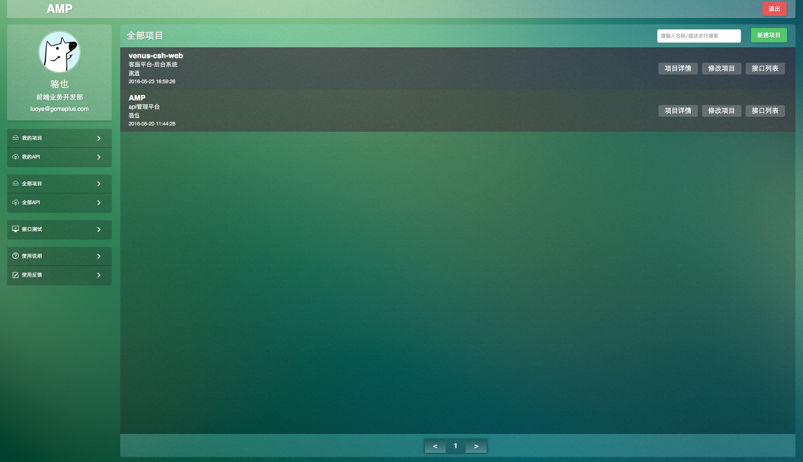
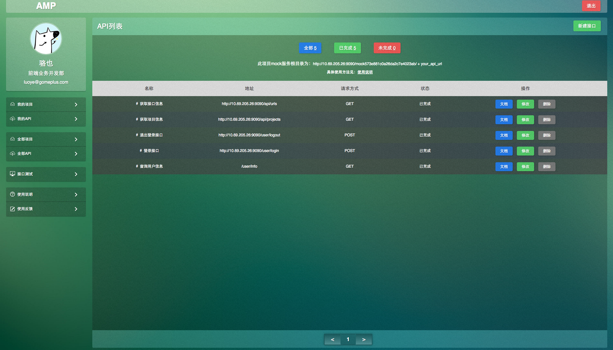
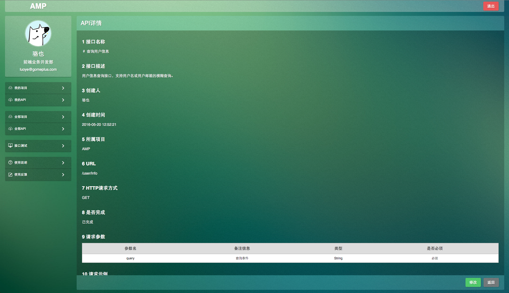
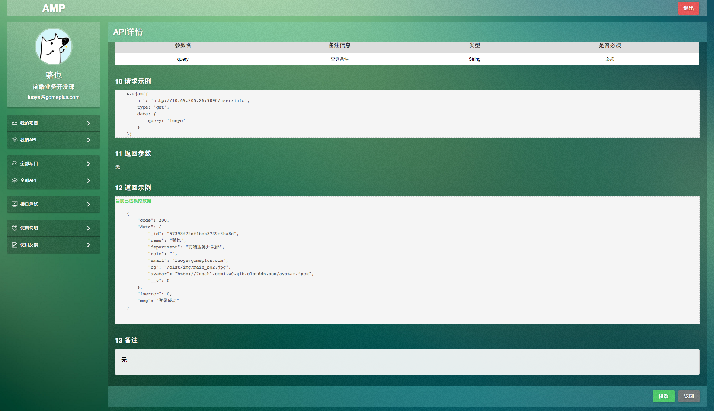
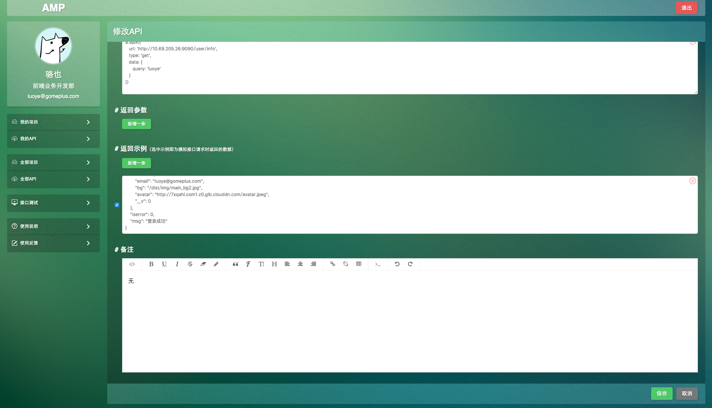

Api manage platform
============================

## 缘由

* 项目开发时接口文档更新不及时，文档格式不一致，文档地址不统一
* 接口未完成时前端调试困难，用本地数据模拟开发完成后修改成本大
...

## 功能

* 根据项目管理接口，开发人员新建项目后再新建接口，书写接口文档，统一进行管理
* 根据项目成员进行权限控制，项目外的人只有查看而没有修改或删除权限
* 提供 `mock server` 服务，详情见下 `Mock Sever` 部分
* 提供简易版 `postman` 测试真实接口功能
* 提供 `http` 和 `https` 两种协议

## Mock Sever

在接口未完成时，本平台可以提供数据的 `mock` 服务。在新建接口时，定义好接口地址，接口参数，接口返回示例（可定义多个，勾选的示例即返回示例），根据本平台 `mock server` 的规则，请求接口，即可获取模拟数据。示例如下：

* 新建项目
* 进入接口列表页
* 可见到如下提示

* 定义接口 `url` `request params` `response example` ...
* 客户端直接请求 `mock 服务根目录 + api_url` ，以及定义好的请求方式和请求参数，即可返回模拟数据（根据所勾选示例）

```js
$.ajax({
	url: 'http://10.69.205.26:9090/mock/573e881c0a26da2c7e4023ab/http://10.69.205.26:9090/api/projects'
	type: 'get',
	data: {
		creator: '573e7b7d796923827d1ab00d',
		limit: 1,
		page: 2
	},
	success: function(res){
		// ...
	}
})
```

## 部署

[部署文档](./doc/deploy.md)

## 开发

[开发文档](./doc/develop.md)

## 截图







